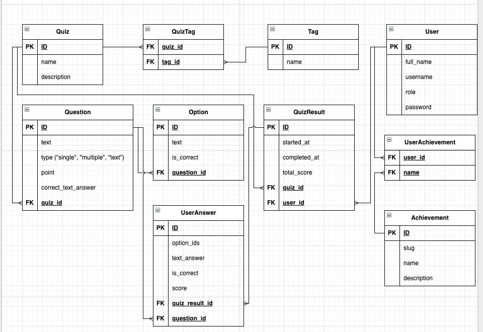

# 🎯 QuizMaker

QuizMaker — backend API для создания и прохождения интерактивных тестов с поддержкой разных форматов вопросов.

---

## 📖 Описание

REST API для:
- создания тестов с вопросами (один ответ, множественный выбор, текст),
- тегирования и фильтрации тестов,
- ведения пользовательского рейтинга.

---

## ⚙️ Почему выбран этот стек

- Я хорошо знаком с Python и асинхронным программированием, поэтому выбрал **FastAPI** — он современный, быстрый и поддерживает автогенерацию документации.
- **PostgreSQL** использую как основную БД за её надёжность и удобство для работы со сложными связями.
- **SQLAlchemy 2.0** (async) позволяет писать чистый и поддерживаемый код, не жертвуя производительностью.
- **Docker** нужен для унификации окружения, быстрой сборки и деплоя (и на локалке, и на сервере).
- **Next.js** фреймворк для React с поддержкой SSR/SSG, быстрое создание фронтенда, интеграция с API.

### Swagger Backend API: http://91.103.107.134/docs/
### Сайт доступен по ссылке: 

---

## 🗂️ Data Model (ER Diagram)

- **Quiz** — Тест, содержит вопросы, связанные с тегами.
- **Question** — Вопрос теста, связан с Quiz, содержит варианты ответа.
- **Option** — Вариант ответа на вопрос.
- **User** — Пользователь (админ или обычный).
- **QuizResult** — Попытка прохождения теста пользователем.
- **UserAnswer** — Ответ пользователя на вопрос (опции или текст).
- **Tag** — Тег теста.
- **QuizTag** — Связь теста и тега (многие-ко-многим).
- **Achievement** — Достижение.
- **UserAchievement** — Полученные пользователем достижения.

---

## ✅ Проверка ответов (ограничения)

- **Один ответ (single):**  
  только один правильный вариант, любой другой — 0 баллов.

- **Множественный выбор (multiple):**  
  если выбран хотя бы один неверный — 0 баллов;  
  если выбраны все и только правильные варианты — максимум баллов;  
  если выбрана часть правильных (и нет неверных) — частичные баллы.

- **Текст (text):**  
  регистронезависимое сравнение строк.

---

## 🚦 Ограничения

- Пользователь не может одновременно проходить два теста: пока не завершён предыдущий, новый начать нельзя.
- Ответы на все вопросы отправляются одним scope только в момент submission.
- Если пользователь закроет браузер до отправки, попытка считается активной — начать новый тест нельзя, пока не завершён предыдущий (не успел реализовать).

---

## 🧑‍💻 Тестовые пользователи

Для быстрого входа в систему используйте следующие тестовые аккаунты:

| Роль     | Логин | Пароль    |
|----------|-------|-----------|
| **Admin**| admin | Admin_123 |
| **User** | user  | User_123  |

---

> **Примечание:** 🕹️ Реализацию режима PVP и генерацию тестов через LLM не успел выполнить в рамках дедлайна, но эти функции легко расширяются на текущей архитектуре.
